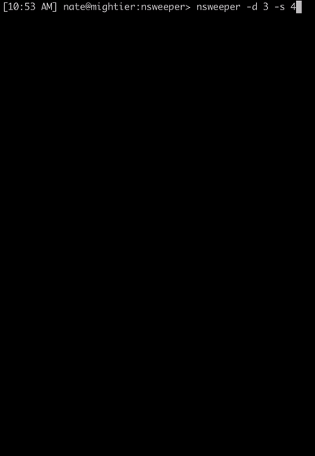

# Nsweeper - Dimensional Minesweeper

Nsweeper is a Minesweeper engine with options for things like size, dimensions, mine density, etc..

Ever wanted to play Minesweeper in 3D? Here's your chance.

Nsweeper is the result of a personal hackathon on Feb 8th, 2020.

### Installing

```
npm i nsweeper -g
```

## Playing

See options:

```
$ nsweeper -h
Usage: nsweeper [options]

Options:
  -V, --version             output the version number
  -s, --size <number>       size of board along each dimension (default: 10)
  -d, --dimension <number>  number of dimensions (default: 2)
  -x, --difficulty <float>  difficulty, a float between 0 and 1 that reflects mine density (default: 0.5)
  -w, --easywin <boolean>   do not require flagging all mines (default: false)
  -h, --help                output usage information
```

Start a game:

```
$ nsweeper -d 3 -s 5
```

Play on the command line:

```
=> Initialized nsweeper board with 3 dimensions, 3 length per dimension, containing 50% mines. Easy win is off.


1      1   2   3
   1   ▆   ▆   ▆
   2   ▆   ▆   ▆
   3   ▆   ▆   ▆

2      1   2   3
   1   ▆   ▆   ▆
   2   ▆   ▆   ▆
   3   ▆   ▆   ▆

3      1   2   3
   1   ▆   ▆   ▆
   2   ▆   ▆   ▆
   3   ▆   ▆   ▆

Pick coordinates, exit, moves, or help:
```

Gif example:



## Todo

- Currently the algorithm to reveal neighbors is incorrect and needs to be updated to only reveal neighbors around coordinates with 0 nearby mines. Might be nice to use `align` on `getNeighbors` as a "hard mode" option. This would have the effect of, for example, not walking to corners on a 2D board if they're 0.
- Web app deployment.

## Authors

- **Nate Hatcher** - _Original Author_ - [hatch](https://github.com/hatch)

See also the list of [contributors](https://github.com/hatch/nsweeper/contributors) who participated in this project.

## License

This project is licensed under the ISC License - see the [LICENSE.md](LICENSE.md) file for details

## Acknowledgments

- [@dankogai](https://github.com/dankogai) for js-combinatorics, `baseN` made finding neighbors in arbitrary dimensions easy.
